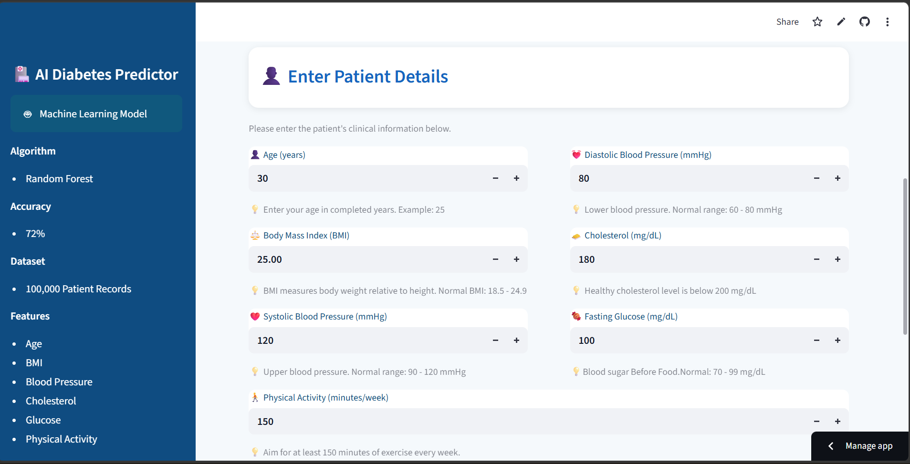
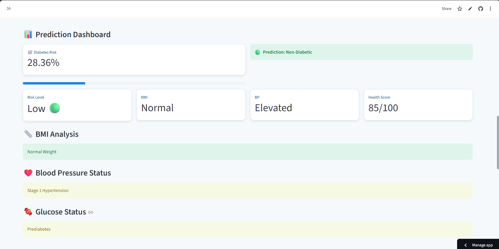
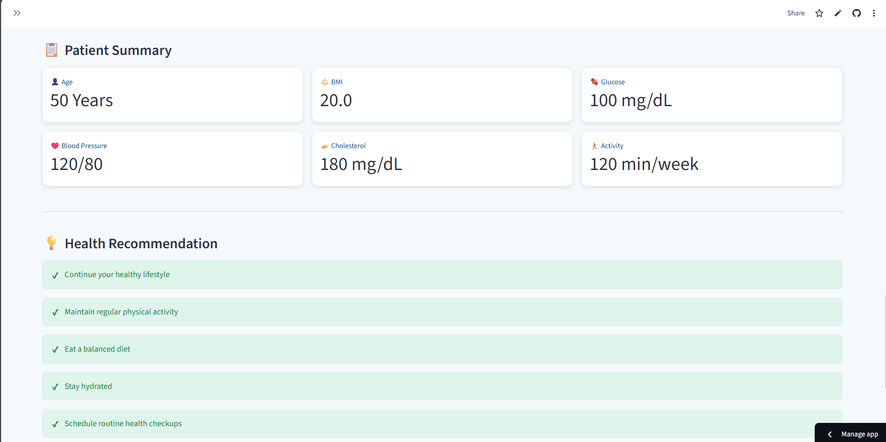

# 🩺 AI-Based Diabetes Prediction System


---

# 📌 Project Overview

The **AI-Based Diabetes Prediction System** is a Machine Learning web application developed using **Python** and **Streamlit**. It predicts the likelihood of diabetes based on important health parameters entered by the user.

The application not only predicts diabetes risk but also provides useful health insights including BMI analysis, Blood Pressure analysis, Blood Glucose analysis, Healthy Lifestyle Score, Patient Health Summary, and Personalized Health Recommendations.

> **Note:** This project is developed for educational and academic purposes only and should not be considered a substitute for professional medical advice.

---

# 🎯 Project Objectives

- Predict diabetes risk using Machine Learning.
- Provide a simple and user-friendly healthcare application.
- Help users understand important health indicators.
- Demonstrate the practical application of Artificial Intelligence in healthcare.
- Generate personalized health recommendations based on user inputs.

---

# ✨ Features

- ✅ Diabetes Prediction
- ✅ Diabetes Risk Percentage
- ✅ BMI Analysis
- ✅ Blood Pressure Analysis
- ✅ Blood Glucose Analysis
- ✅ Healthy Lifestyle Score
- ✅ Patient Health Summary
- ✅ Personalized Health Recommendations
- ✅ Modern & Professional User Interface
- ✅ Educational Medical Disclaimer

---

# 🧠 Machine Learning Model

## Algorithm Used

- Random Forest Classifier

## Model Configuration

- Number of Trees: **100**
- Maximum Tree Depth: **15**
- Minimum Samples per Leaf: **5**
- Random State: **42**

## Input Features

- Age
- Body Mass Index (BMI)
- Systolic Blood Pressure
- Diastolic Blood Pressure
- Total Cholesterol
- Fasting Blood Glucose
- Physical Activity (Minutes per Week)

## Output

- Diabetic
- Non-Diabetic
- Diabetes Risk Percentage

---

# 📊 Model Performance

| Metric | Value |
|---------|-------|
| Accuracy | **72.76%** |
| Precision | **76.59%** |
| Recall | **78.22%** |
| F1-Score | **77.39%** |
| ROC-AUC Score | **80.21%** |

---

# 🔄 Project Workflow

1. User enters health information.
2. Input data is standardized using **StandardScaler**.
3. The trained **Random Forest Classifier** predicts the diabetes risk.
4. The application calculates the diabetes risk percentage.
5. The system displays:
   - Diabetes Prediction
   - Risk Percentage
   - BMI Analysis
   - Blood Pressure Analysis
   - Blood Glucose Analysis
   - Healthy Lifestyle Score
   - Patient Health Summary
   - Personalized Health Recommendations

---

# 🛠️ Technologies Used

- Python
- Streamlit
- Scikit-learn
- Pandas
- NumPy
- Joblib

---

# 📂 Dataset Information

- Diabetes Health Dataset
- Total Records: **100,000**
- Binary Classification Problem

### Target Variable

- **0 → Non-Diabetic**
- **1 → Diabetic**

> **Note:** The original dataset is not included in this repository because of GitHub file size limitations. The trained model (`model.pkl`) is included for prediction purposes.

---

# 📁 Project Structure

```
AI-Based-Diabetes-Prediction-System/
│
├── app.py
├── train_model.py
├── model.pkl
├── scaler.pkl
├── banner.png
├── requirements.txt
├── README.md
└── .gitignore
```

---

# 📦 Requirements

- Python 3.10 or above
- Streamlit
- Pandas
- NumPy
- Scikit-learn
- Joblib

---

# 🚀 Installation Guide

## 1. Clone the Repository

```bash
git clone https://github.com/boyareddygaridineshreddy/AI-Based-Diabetes-Prediction-System.git
```

## 2. Move into the Project Folder

```bash
cd AI-Based-Diabetes-Prediction-System
```

## 3. Install Required Packages

```bash
pip install -r requirements.txt
```

## 4. Run the Application

```bash
streamlit run app.py
```

---

# 🖥️ Application Preview

## 🏠 Home Page



---

## 📊 Prediction Result



---

## 📋 Patient Health Summary



---

# 💡 Future Enhancements

- User Login & Authentication
- Patient History Database
- Doctor Dashboard
- PDF Medical Report Generation
- Cloud Database Integration
- Mobile Application
- Deep Learning Models
- Wearable Device Integration
- Multi-Disease Prediction System

---

# ⚠️ Disclaimer

This application provides an AI-based diabetes risk prediction for educational purposes only.

It is **not intended to replace professional medical advice, diagnosis, or treatment**.

Always consult a qualified healthcare professional before making medical decisions.

---

# 👨‍💻 Developer

## **B Dinesh**

**B.Tech – Computer Science and Engineering (Artificial Intelligence & Machine Learning)**

**SCSVMV University**

GitHub: https://github.com/boyareddygaridineshreddy

---

# ⭐ Support

If you found this project useful, please consider giving it a ⭐ on GitHub.

Thank you for visiting this project!

---

## 📧 Contact

**Developer:** B Dinesh

**GitHub:** https://github.com/boyareddygaridineshreddy
